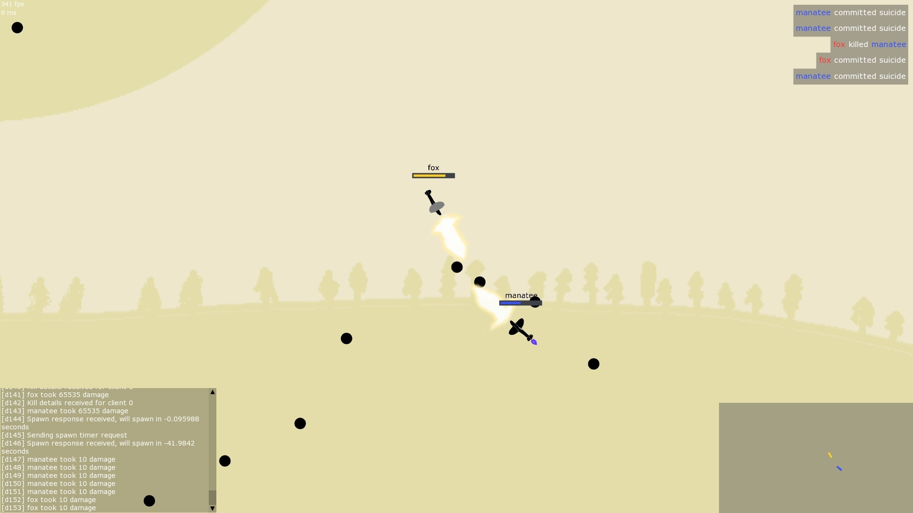

# Lentokonepeli-X

Written in 2018

A multiplayer arena shooter with planes in C++.
Game engine from scratch, [SFML](https://www.sfml-dev.org/) used for rendering and audio, inheritance based game objects, collisions and physics.
Custom realtime networking with [RakNet](http://www.jenkinssoftware.com/). Currently has bad latency as it's very difficult to do client-side prediction right with projectile weapons.

Can downloaded from [releases](https://github.com/birusq/lentokonepeli-x/releases/latest).
